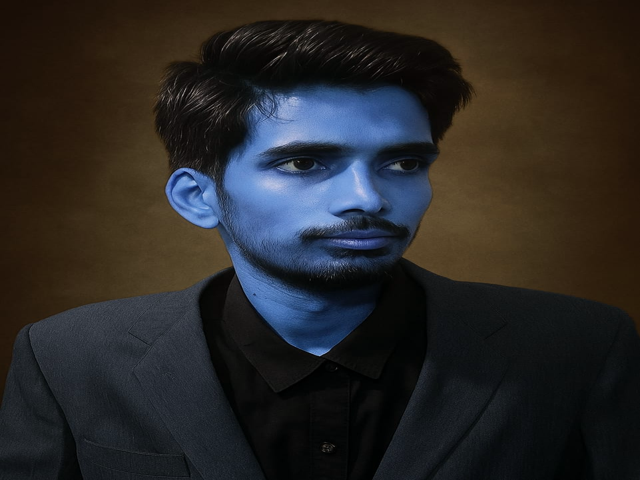

# 🖐️ AirDraw – Draw with Your Hand

A gesture-based virtual drawing app built using **Python**, **OpenCV**, and **MediaPipe**. Use your index finger as a pen — no touch or mouse required!

> 🎯 Live hand tracking  
> ✍️ Draw in air using finger  
> 🎨 Open palm changes color  
> ✊ Fist clears canvas  
> 💾 Save drawings as image files

---

## 📷 Demo

---

## 🚀 Features

- Real-time hand detection and tracking
- Draw on virtual canvas using index finger
- Gesture controls:
  - ✊ Closed fist → clear canvas
  - ✋ Open palm → change color
  - ☝️ Index finger → draw
- Save canvas as PNG
- Optionally draw on uploaded image

---

## 🛠️ Tech Stack

| Tool         | Use                         |
|--------------|-----------------------------|
| Python       | Programming Language        |
| OpenCV       | Webcam input + drawing      |
| MediaPipe    | Hand landmark detection     |
| Streamlit    | GUI for live interaction    |
| NumPy        | Pixel data & arrays         |
| Pillow       | Image saving support        |

---

## 📦 Setup Instructions

1. **Clone the repo:**

git clone https://github.com/daiyankhan191/AirDraw.git
cd AirDraw

2.Install dependencies:

bash
Copy
Edit
pip install -r requirements.txt

3. Run the app:

bash
Copy
Edit
streamlit run gui/streamlit_app.

📁 Folder Structure
bash
Copy
Edit
AirDraw/
├── gui/
│   └── streamlit_app.py       # Main UI
├── hand_tracker.py            # Hand detection logic
├── gesture_utils.py           # Gesture recognition
├── drawer.py                  # Drawing logic
├── config.py                  # Color & config settings
├── save_utils.py              # Save canvas as image
├── requirements.txt
├── runtime.txt
└── README.md

🙋‍♂️ Author
Daiyan Khan
Project for Computer Vision + Interaction demo

